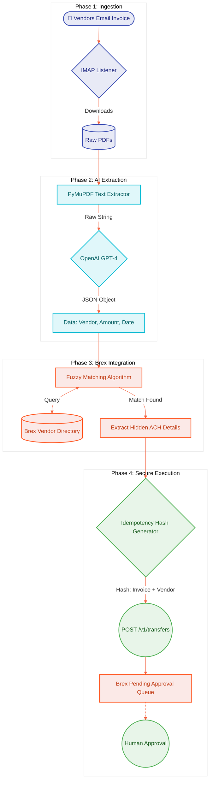

<div align="center">
  
  
  
  <br>
  <h1>🚀 Brex AutoPay Pipeline (Email-to-Paid Engine)</h1>
  <p><b>An Autonomous, AI-Driven Financial Pipeline for Zero-Touch Invoice Processing</b></p>
  <p><i>Developed by <b>Vamshi Batthula</b> (<a href="mailto:batthulavamshi740@gmail.com">batthulavamshi740@gmail.com</a>)</i></p>
</div>

## 📖 About The Project
The **Brex AutoPay Pipeline** is an elite, fully autonomous Accounts Payable (AP) engine engineered to eradicate manual data entry and enforce zero-defect financial workflows. Designed with the architectural rigor of top-tier fintech platforms (like Ramp and Stripe), this pipeline transforms raw, unstructured invoice data into secure, ledger-ready draft payments with zero human intervention.

By harmonizing advanced AI for data extraction with cryptographic duplicate prevention (Idempotency), this project showcases a production-ready, highly secure bridge between standard email protocols and modern corporate banking APIs.

### 🌟 Key Technologies & Topics
`Fintech Architecture` `Accounts Payable Automation` `OpenAI GPT-4` `Brex API Integration` `Idempotency & Cryptography` `Python 3.12` `PyMuPDF` `IMAP Parsing` `Zero-Trust Security` `Process Engineering`

---

## 🧠 System Architecture & Workflow

The architecture is designed with strict boundaries between data extraction and financial disbursement. The system acts strictly as an intelligent "drafter", ensuring funds never leave the account without final human authorization.



---

## 🛡️ Enterprise Security: Idempotency & Duplicate Prevention

One of the most dangerous risks in AP automation is paying the same invoice twice. This engine solves this completely using **Cryptographic Idempotency**.

Instead of sending generic requests, the pipeline generates a unique MD5 Hash signature for every single invoice based on its Invoice Number and Vendor Name. 

```python
invoice_string = f"Invoice {invoice_number} from {vendor_name}"
idemp_key = hashlib.md5(invoice_string.encode('utf-8')).hexdigest()
```

If the script runs twice on the same email, or if a vendor sends a duplicate PDF, the mathematical hash remains identical. Brex's API instantly recognizes the duplicate Hash and **blocks the second payment from ever being created.** 

---

## ⚡ Quick Start Guide

### 1. Requirements
- Python 3.10+
- A Brex Account (with `Account Admin` privileges for the API Token)
- An AP Gmail Account (with an App Password)
- OpenAI API Key

### 2. Secure Configuration
Clone the repository and create a `.env` file at the root. **This file is automatically protected by `.gitignore`**.

```env
BREX_USER_TOKEN=your_brex_token (Requires full Read/Write for Vendors & Transfers)
EMAIL_ACCOUNT=ap@yourcompany.com
EMAIL_PASSWORD=your_gmail_app_password
OPENAI_API_KEY=sk-your-openai-key
```

### 3. Execution
```bash
pip install -r requirements.txt
python main.py
```

### 4. Observe the Magic
The terminal will output the live extraction and matching process, ending with a success payload. Log into your Brex Dashboard and check the **Tasks / Approvals** tab to view your perfectly drafted, ready-to-approve payments!

---
<div align="center">
  <i>Engineered for precision. Built for scale.</i>
</div>
