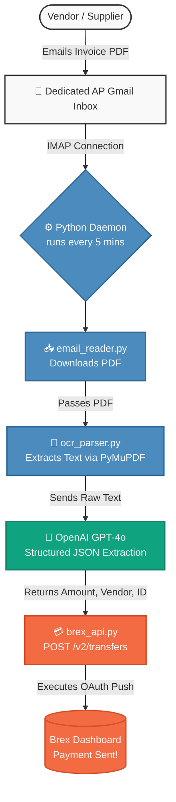

# Brex Custom AP Automation Pipeline

[](https://opensource.org/licenses/MIT)
[](https://www.python.org/downloads/)

An enterprise-grade, fully automated Accounts Payable (AP) pipeline designed specifically for **Brex**. 

Unlike Ramp, Brex's API does not permit developers to access OCR-generated Draft Bills. To bypass this limitation, this architecture implements a **Custom AI Pipeline**. By intercepting vendor invoices via a dedicated Gmail inbox, the Python daemon uses advanced AI (OpenAI GPT-4o / PyMuPDF) to execute its own OCR extraction before pushing a fully approved payment directly to the Brex API.

---

## 🏗️ Architectural Flowchart



---

## 🚀 Features
* **Bypasses Brex Limitations**: Custom OCR engine eliminates the need for Brex's hidden drafts.
* **100% Automated**: Runs as a background daemon polling every 5 minutes.
* **Safe Testing Mode**: Built-in `TEST_MODE` to simulate the pipeline and view AI extraction results without moving real money.
* **Smart Inbox Management**: Only processes the 5 most recent unread emails to prevent memory hangs on large inboxes.

## 🛠️ Installation & Setup

1. **Clone the repository:**
   ```bash
   git clone https://github.com/Vamshi868876/brex-payment-automation-.git
   cd brex-payment-automation-
   ```

2. **Install dependencies:**
   ```bash
   pip install -r requirements.txt
   ```

3. **Configure Environment:**
   Create a `.env` file in the root directory and populate it with your credentials:
   ```env
   # Brex API Credentials
   BREX_USER_TOKEN=your_brex_user_token_here
   
   # Gmail IMAP Credentials
   EMAIL_ACCOUNT=your_email@gmail.com
   EMAIL_PASSWORD=your_gmail_16_letter_app_password
   
   # OpenAI API Key (For Custom OCR)
   OPENAI_API_KEY=sk-your-openai-key
   ```

4. **Run the Daemon:**
   ```bash
   python main.py
   ```

## 🔒 Security Note (Test Mode)
By default, this repository is configured with `TEST_MODE = True` in `config.py`. This ensures that while you are testing the AI and Email integrations, **no real money will be transferred via Brex**. Once you have verified the AI is extracting vendor names and amounts accurately, switch it to `False` to enable live payments.

## 👨‍💻 Author
Built by **Vamshi Batthula**.
