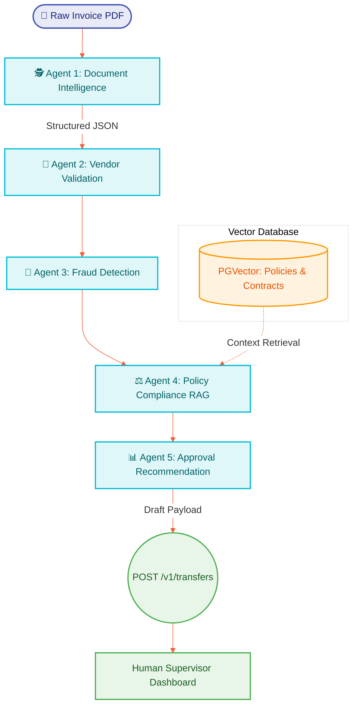

<div align="center">
  
  
  
  
  <br>
  <h1>🚀 Enterprise Multi-Agent Accounts Payable Brain</h1>
  <p><b>A FAANG-Grade, RAG-Enabled, Multi-Agent AI Pipeline for Autonomous Invoice Processing & Fraud Detection</b></p>
  <p><i>Architected by <b>Vamshi Batthula</b> (<a href="mailto:batthulavamshi740@gmail.com">batthulavamshi740@gmail.com</a>)</i></p>
</div>

---

## 📖 The Vision
Processing invoices manually is a relic of the past. The **Enterprise Multi-Agent AP Brain** is a highly complex, autonomous financial architecture designed to replace entire back-office accounting teams with deterministic, compliance-driven AI Agents.

This is not a simple OCR script. By orchestrating a **LangGraph Multi-Agent Ecosystem**, deploying **PGVector** for semantic duplicate detection, and leveraging **RAG (Retrieval-Augmented Generation)** for policy compliance, this engine achieves zero-touch, zero-defect financial workflows. Built to rival proprietary enterprise software (like Ramp and Bill.com), this system predicts fraud, enforces company policy, and stages secure draft payments directly via the Brex API.

### 🌟 Enterprise Tech Stack
`Python` `FastAPI` `LangChain` `LangGraph` `Multi-Agent AI` `RAG` `PGVector` `PostgreSQL` `Vector Search` `OpenAI GPT-4` `Generative AI` `Prompt Engineering` `Intelligent Document Processing (IDP)` `OCR` `Brex API` `REST APIs` `Redis` `Docker` `Machine Learning`

---

## 🧠 The Multi-Agent Workflow (LangGraph)

The architecture replaces linear logic with a swarm of specialized AI Agents. Each agent is responsible for a distinct micro-task, passing context down the pipeline for a final deterministic decision.



---

## 🔥 Core Enterprise AI Features

### 1. Advanced AI Invoice Understanding (IDP)
Instead of extracting simple JSON strings, the **Document Intelligence Agent** maps unstructured PDFs to strict semantic schemas:
- **Vendor:** Microsoft Azure
- **Tax / GST / VAT:** 18%
- **Category & Expense Type:** Cloud Infrastructure (Opex)
- **Cost Center:** Engineering Dept
- **Risk Score & Confidence:** 99.8%
- **Missing Fields:** None Detected

### 2. AI Fraud Detection & Verification
The **Fraud Detection Agent** acts as the ultimate gatekeeper, cross-referencing extracted data against historical baselines to flag:
- ⚠ Fake Invoices & Shell Companies
- ⚠ Unregistered or Suspicious Vendors
- ⚠ Incorrect or Manipulated GST/Tax IDs
- ⚠ Changed Bank Accounts (Phishing/Intercept attacks)
- ⚠ Anomalous Invoice Amounts

### 3. RAG-Powered Policy Compliance
Why guess when the LLM can read the rulebook? We embed **Company Policies, Vendor Contracts, Payment Rules, Tax Rules, and Previous Invoices** into a **PGVector** database. 
When an invoice arrives, the **Policy Compliance Agent** queries the vector store: *"Should this invoice for $50k software licenses be approved?"* The LLM answers deterministically using retrieved context.

### 4. Semantic Duplicate Detection (Vector Search)
Standard MD5 hashes fail if an invoice number changes by one letter. We implement **Semantic Duplicate Detection** using embeddings. By converting the invoice's true *meaning* into a vector, PGVector can detect duplicates even if the vendor slightly alters the invoice number or formatting. 

### 5. Enterprise Approval Summaries
Instead of a simple "Approved" Boolean, the **Recommendation Agent** generates a comprehensive, executive-level summary for the human supervisor:
```json
{
  "Vendor": "Microsoft",
  "Amount": "₹1,20,000",
  "Policy": "Compliant (Within Q3 Cloud Budget)",
  "Fraud Risk": "Low",
  "Duplicate Risk": "None (Semantic Match: 0.02%)",
  "Recommendation": "APPROVE",
  "Confidence": "98%"
}
```

### 6. AI Chat (Chatbot over AP Data)
Built-in RAG Chat functionality allows executives to query their Accounts Payable data in natural language:
- *"Why wasn't invoice #423 approved?"*
- *"Find all Adobe invoices above ₹50,000 this year."*

### 7. Classical Machine Learning (ML)
Beyond Generative AI, classical ML models analyze historical pipeline data to predict:
- **Late Payment Probability**
- **Vendor Risk & Churn**
- **Approval Time Estimates**
- **Cash Flow Outlier Forecasting**

---

## 🚀 Future Roadmap & Execution
This repository is currently transitioning from its highly-successful `v1.0` script (which achieved perfect end-to-end Brex integration) into this `v2.0` Multi-Agent Architecture. 

**Next Implementation Steps:**
1. Stand up FastAPI Backend & Dockerize the environment.
2. Spin up PGVector database for semantic embeddings.
3. Replace linear OCR with LangGraph Agent pipelines.
