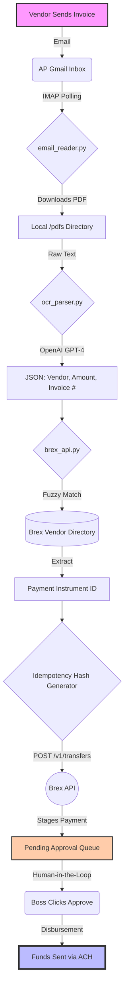

# Brex AutoPay Pipeline (Email-to-Paid Engine)


## 📌 About The Project
The **Brex AutoPay Pipeline** is a highly secure, automated Accounts Payable (AP) engine designed to completely eliminate manual invoice entry. It securely monitors a designated AP inbox, intelligently extracts vendor and pricing data from raw PDF attachments using OpenAI, dynamically cross-references internal Brex Vendor Registries, and automatically stages Draft Transfers in the Brex dashboard for final human approval.

This project was built to mimic the automation capabilities of platforms like Ramp, bringing FAANG-level engineering standards to back-office financial operations.

### Topics & Tags
`Python`, `Automation`, `Brex API`, `Fintech`, `Accounts Payable`, `OpenAI`, `PyMuPDF`, `IMAP`, `Security`, `Idempotency`

---

## 🏗️ System Architecture

The pipeline follows a strict, one-way data flow to ensure financial security and zero accidental disbursements.



---

## 🔒 Security & Duplicate Prevention (Idempotency)

One of the biggest risks in financial automation is the accidental processing of duplicate invoices. This pipeline implements enterprise-grade duplicate protection mirroring systems built by Ramp.

### How it Works:
Instead of sending a random UUID to Brex for every API request, the `create_vendor_payment` function generates a unique cryptographic hash using the **Invoice Number** and the **Vendor Name**:

```python
invoice_string = f"Invoice {invoice_number} from {vendor_name}"
idemp_key = hashlib.md5(invoice_string.encode('utf-8')).hexdigest()
headers["Idempotency-Key"] = idemp_key
```

When this key is passed to the Brex API (`/v1/transfers`), Brex checks its internal ledger. If the script accidentally loops over the same email, or a vendor sends the exact same invoice twice, the hashes will match perfectly. **Brex will instantly block and ignore the duplicate request.** This guarantees that no matter how many times the script is run, only **one** Draft Bill will ever be created per invoice.

---

## 🚀 Setup & Installation

### 1. Prerequisites
- Python 3.10+
- A Brex Account with Admin privileges
- A Gmail Account with App Passwords enabled
- An OpenAI API Key

### 2. Environment Variables
Create a `.env` file in the root directory and add the following keys. **(Never commit this file!)**

```env
# Brex Settings
BREX_USER_TOKEN=your_secure_brex_token_here

# Gmail Settings
EMAIL_ACCOUNT=your_ap_inbox@gmail.com
EMAIL_PASSWORD=your_gmail_app_password

# AI Settings
OPENAI_API_KEY=your_openai_api_key
```

### 3. Install Dependencies
```bash
pip install -r requirements.txt
```

### 4. Run the Pipeline
```bash
python main.py
```
The script will output `SUCCESS! Brex Payment ID: dptx_...` and the transfer will be safely waiting in your Brex Pending Approvals queue.

---

## 🤝 Human-in-the-Loop Guarantee
This automation operates entirely as a "Drafting" agent. It utilizes the `/v1/transfers` API combined with your company's internal approval policies. This means that while the bot does 100% of the data entry and routing, **0 funds will ever leave the originating checking account without explicit, manual approval from an authorized manager inside the Brex dashboard.**
